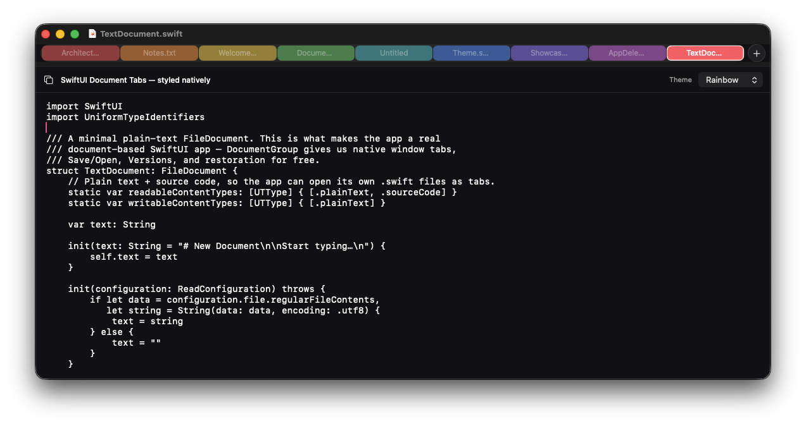
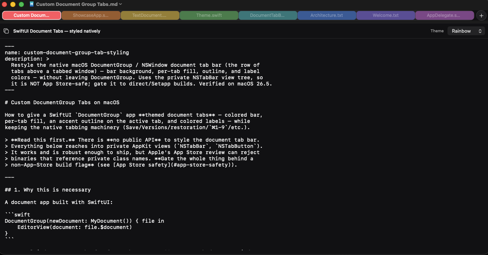
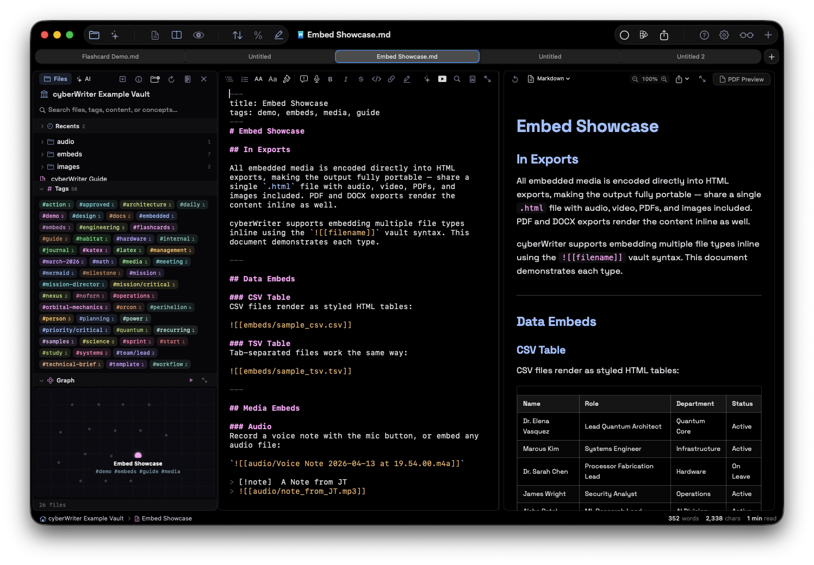
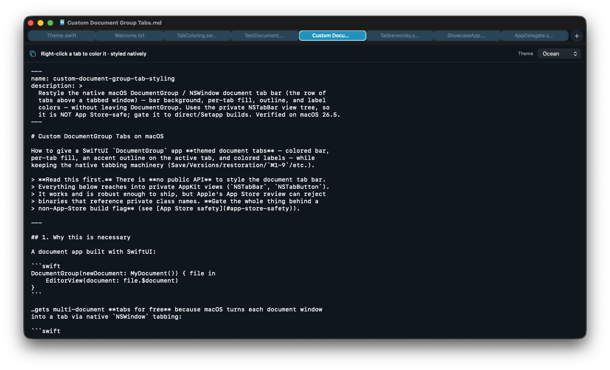
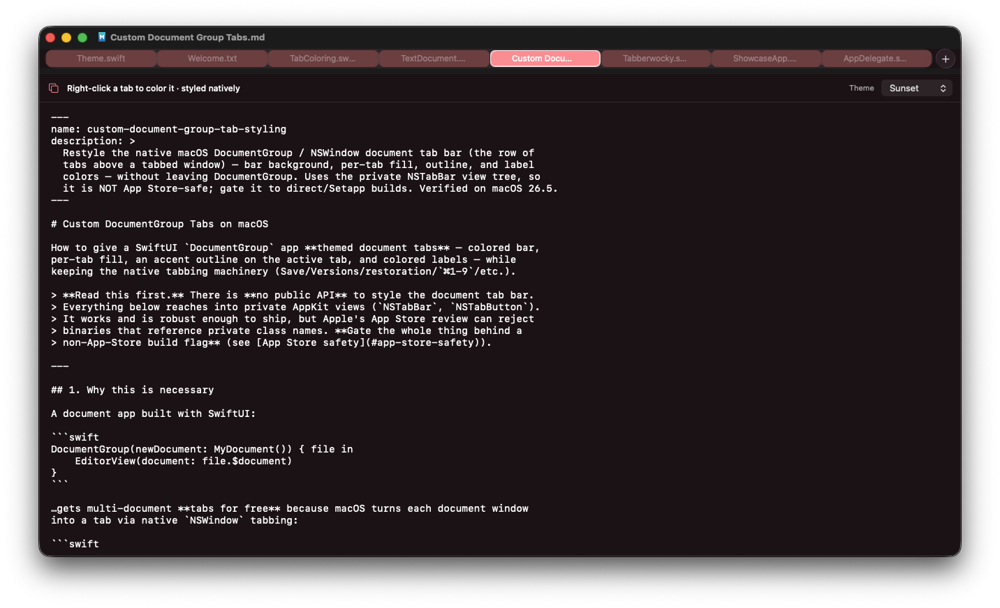
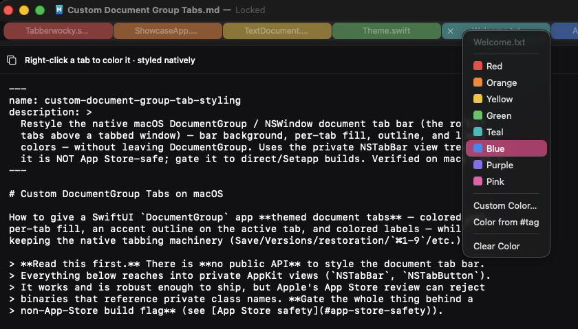

# Tabberwocky

**Style the native macOS `DocumentGroup` document tabs.** Bar background, per-tab
fill, active-tab outline, label colors, the `+` button — and dynamic per-tab
colors at runtime — *without leaving `DocumentGroup`* and without building your own
tab bar.

The common wisdom is that you **can't** restyle the native window/document tab bar
— it's private, end of story. You mostly can. Tabberwocky is the small, current
(macOS 26 "liquid glass"–aware) library that does it.



> [!WARNING]
> Tabberwocky reaches into the **private** AppKit tab-bar view tree
> (`NSTabBar` / `NSTabButton`). It is **not App Store-safe** — review can reject
> binaries that reference private class names. Gate it behind a non-App-Store build
> flag (Developer ID / Setapp / direct distribution). See [Caveats](#caveats).

---

## Why this exists

A SwiftUI document app gets multi-document **tabs for free**:

```swift
DocumentGroup(newDocument: MyDocument()) { file in
    EditorView(document: file.$document)
}
```

…but those tabs are drawn by a private `NSTabBar`, and Apple ships **no public API**
to style them. So you're stuck with stock gray tabs, or you throw away
`DocumentGroup` and rebuild tabs (and Save / Versions / restoration / `⌘1–9`) from
scratch. Tabberwocky is the third option: keep all the native machinery, restyle
the chrome.

## What you can change

| Element | |
|---|---|
| **Bar background** | matches your titlebar |
| **Per-tab fill** | any color/alpha — uniform, by index, by tag, or a user pick |
| **Active outline** | accent border on the selected tab |
| **Label colors** | active / inactive, plus per-tab via `textForTab` (sets `attributedTitle`) |
| **`+` button** | tint the glyph |

<p align="center">
  
  
</p>

### Themes

The same tab bar, restyled live. Tabberwocky takes any colors you give it.

<p align="center">
  
  
</p>

### Custom per-tab color & color-from-#tag

<p align="center">
  
</p>

## Install

**Swift Package Manager**

```swift
.package(url: "https://github.com/uncSoft/Tabberwocky", from: "1.0.0")
```

…then `import Tabberwocky`.

**Single file**

Or just drag [`Sources/Tabberwocky/Tabberwocky.swift`](Sources/Tabberwocky/Tabberwocky.swift)
into your target. No dependencies. Want colors to persist across launches? Add the
optional [`TabberwockyColorStore.swift`](Sources/Tabberwocky/TabberwockyColorStore.swift)
too (see [Persistence](#persistence)).

## Usage

Call once at launch (e.g. in your `AppDelegate`), behind your distribution flag:

```swift
#if DIRECT_DISTRIBUTION || SETAPP_DISTRIBUTION
Tabberwocky.shared.style = {
    TabberwockyStyle(
        barBackground: .black,
        activeFill:    NSColor.white.withAlphaComponent(0.10),
        inactiveFill:  NSColor.white.withAlphaComponent(0.04),
        activeText:    .systemBlue,
        inactiveText:  NSColor.white.withAlphaComponent(0.55),
        activeOutline: .systemBlue,
        newButtonTint: .systemBlue
    )
}
Tabberwocky.shared.start()                 // re-applies on key/update/resize
#endif
```

You also need native window tabbing on (standard for document apps):

```swift
NSWindow.allowsAutomaticWindowTabbing = true
UserDefaults.standard.set("always", forKey: "AppleWindowTabbingMode")
```

When your theme changes, call `Tabberwocky.shared.refresh()` — or pass your own
notification to `start(reapplyOn:)`:

```swift
Tabberwocky.shared.start(reapplyOn: [.myAppearanceChanged])
```

### Dynamic / per-tab colors

Return a color per tab from `fillForTab` (return `nil` to use `style`). The tab's
`documentURL` lets you key off the file — color by tag, by a user pick, anything.
Indexed colors (a "rainbow") work too:

```swift
Tabberwocky.shared.fillForTab = { index, documentURL, active in
    if let chosen = myColorStore[documentURL] { return chosen }   // user pick
    return rainbow[index % rainbow.count]                          // or by index
}
```

### Label text colors

Labels are colored from `style.activeText` / `style.inactiveText` by default. For
per-tab control there's a `textForTab` closure, symmetric with `fillForTab` — return
a color to override a single tab's label, or `nil` to fall back to the style.

The library doesn't force any label color on you. The common case is keeping labels
legible on saturated fills, which is one line — give any tab that has a custom fill a
white label:

```swift
Tabberwocky.shared.textForTab = { index, documentURL, active in
    guard Tabberwocky.shared.fillForTab?(index, documentURL, active) != nil else {
        return nil                                   // use style.activeText/inactiveText
    }
    return NSColor.white.withAlphaComponent(active ? 1.0 : 0.85)
}
```

You can just as easily color labels by tag, dim background tabs harder, or anything
else — it's the same per-tab signature as the fill.

## Persistence

`fillForTab` / `textForTab` are stateless, so where colors *live* is up to you. If
you don't want to build that yourself, add the optional
[`TabberwockyColorStore.swift`](Sources/Tabberwocky/TabberwockyColorStore.swift). It
saves per-document fill and label colors to `UserDefaults`, keyed by file URL, so a
tab keeps its color across launches.

The whole thing, persisted, in four lines:

```swift
let colors = TabberwockyColorStore()
colors.attach()                                              // wires fillForTab + textForTab
Tabberwocky.shared.style = { /* your theme */ }
Tabberwocky.shared.start(reapplyOn: [TabberwockyColorStore.colorsChanged])
```

Then set a color when the user picks one, and it sticks:

```swift
colors.setColor(.systemTeal,   for: document.fileURL, .fill)
colors.setColor(.systemYellow, for: document.fileURL, .label)
colors.setColor(nil,           for: document.fileURL, .fill)   // clear
```

If you already compose your own `fillForTab` (rainbow, tag colors, whatever), skip
`attach()` and just read `colors.color(for:_:)` inside your closures — the store is
only the storage, it doesn't take over. Pass a custom `UserDefaults` /
`storageKey` to the initializer if you need to namespace or use an app group.

## Example

[`Examples/DocumentTabsShowcase`](Examples/DocumentTabsShowcase) is a real,
minimal `DocumentGroup` app that **consumes Tabberwocky as a Swift package**
(via a local path while developing) and demonstrates everything:

- 6 themes incl. **Rainbow** (per-tab colors)
- **Right-click a tab → preset / custom color / "Color from #tag" / clear** — with
  live recolor as you edit the tag
- It opens its own source (and this library) as tabs, so it's self-documenting

```sh
cd Examples/DocumentTabsShowcase && ./build.sh && open DocumentTabsShowcase.app
```

## How it works

Short version: walk down from `window.contentView?.superview` to find the private
`NSTabBar`, then set layer colors / borders and KVC `attributedTitle` on the tab
views, re-applying on the notifications AppKit fires when it repaints. Active tab
is found via the public `NSWindowTabGroup` (the tab views aren't `NSButton`s, so
they have no `.state`).

The full write-up — verified view hierarchy, every piece enumerated, and the
dead-ends — is in
[`docs/custom-document-group-tab-styling.md`](docs/custom-document-group-tab-styling.md).

## Caveats

- **Not App Store-safe.** Private AppKit class names → gate to direct/Setapp builds.
- **Private hierarchy.** Class names/structure can shift between macOS releases;
  Tabberwocky fails soft (does nothing) if it can't find the views. Verified on
  macOS 26.5.
- **The Tahoe glass floor.** On macOS 26 each tab's label/icon live *inside* an
  `NSGlassEffectView`, so you can **tint** the glass but can't fully remove it —
  a perfectly matte tab isn't possible without losing the label.
- **Re-applies on notifications**, not a timer. AppKit repaints the bar on its own;
  Tabberwocky reasserts the style (coalesced) rather than polling.

## Roadmap

Tabberwocky is early and actively evolving. Planned:

- **Extensibility** — more hooks: per-tab icons, custom fonts, a `willStyleTab`
  callback, and a pluggable tab→document resolver.

Contributions and ideas welcome.

## License

MIT — see [LICENSE](LICENSE).
